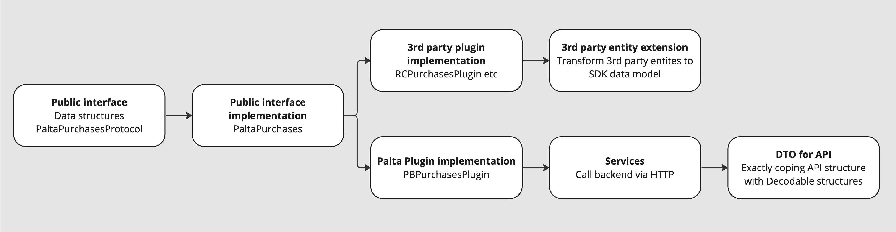

# Development

## More about plugins
Because we use different sources of data in form of plugins, we need to merge this data. Entity responsible for merging results of different plugins is `PaltaPurchases`. It has several private helper methods that handle most of the logic to call all plugins and manage collection of async results:
```
    private func start<T>(
        completion: @escaping (Result<T, Error>) -> Void,
        execute: @escaping (PurchasePlugin, @escaping (PurchasePluginResult<T, Error>) -> Void) -> Void
    )
    
    private func with<T>(
        _ plugin: PurchasePlugin,
        completion: @escaping (Result<T, Error>) -> Void,
        execute: @escaping (PurchasePlugin, @escaping (PurchasePluginResult<T, Error>) -> Void) -> Void
    )
    
    private func callAndCollect<T>(
        call: (PurchasePlugin, @escaping (Result<T, Error>) -> Void) -> Void,
        completion: @escaping (Result<[T], Error>) -> Void
    )
    
    private func callAndCollectPaidFeatures(
        to completion: @escaping (Result<PaidFeatures, Error>) -> Void,
        call: (PurchasePlugin, @escaping (Result<PaidFeatures, Error>) -> Void) -> Void
    )
```

When implementing plugin, you can use `PurchasePluginResult` enitity as a return type. It has 3 possible values:
```
public enum PurchasePluginResult<Success, Failure: Error> {
    /// Operation successfuly completed.
    case success(Success)
    
    /// Plugin handled input, but operation failed with error. Pass failure to user.
    case failure(Failure)
    
    /// Passed input can't be handled by this plugin. Pass control to next plugin.
    case notSupported
}
```
It is crucial to return `.notSupported` for operations that should be handled by only one plugin. For example, when we purchase a product, it is a product from **one** of the systems we use and all other plugins must return `.notSupported` in order to help `PaltaPurchases` find the right one.

## Typical feature structure


### Public interfaces
You setup public interfaces for the feature by creating public data structures and declaring methods in `PaltaPurchasesProtocol`. Public structures are contained in `Sources/PaltaPayments/Public/Data`.

### Public interface implementation
`PaltaPurchases` has to conform to `PaltaPurchasesProtocol`, so you implement method that you declared. Implementation consists of checking that setup is finished (`checkSetupFinished()`) and calling all plugins with one of helper methods.
You will need to declare necessary methods in `PurchasePlugin` protocol.

### Implementing 3rd party plugins
When implementing methods in 3rd party plugins, you usually call one of the 3rd party SDK methods. Then you implement an extension for 3rd party entities to transform them to our entities. For example, you can have a look at `StoreProduct+Product.swift` file.

### Implementing Palta plugin
Implementing Palta plugin usually consists of following steps:

1. You create a DTO representing your HTTP request payload (example: `GetFeaturesRequestPayload.swift`)
2. You add new HTTP request case to `PaymentsHTTPRequest`
3. You create a DTO representing your HTTP response payload. Usually, it is 2 DTOs: for response intself and for target entity. (example: `FeaturesResponse.swift` and `FeatureInternal.swift`)
4. You create a service that calls backend via HTTP using all things you created in steps 1-3. Sometimes, you need a complex structure of services depending on each other to allow testing of all business logic.
5. You add your service to DI container (see `PaymentsAssembly.swift`)
6. Call your new service from `PBPurchasePlugin`
